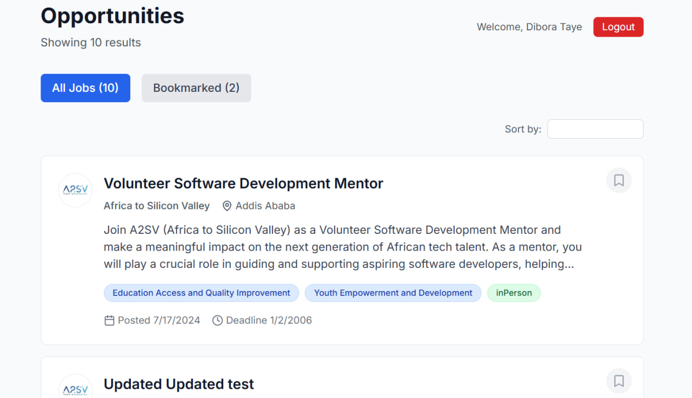
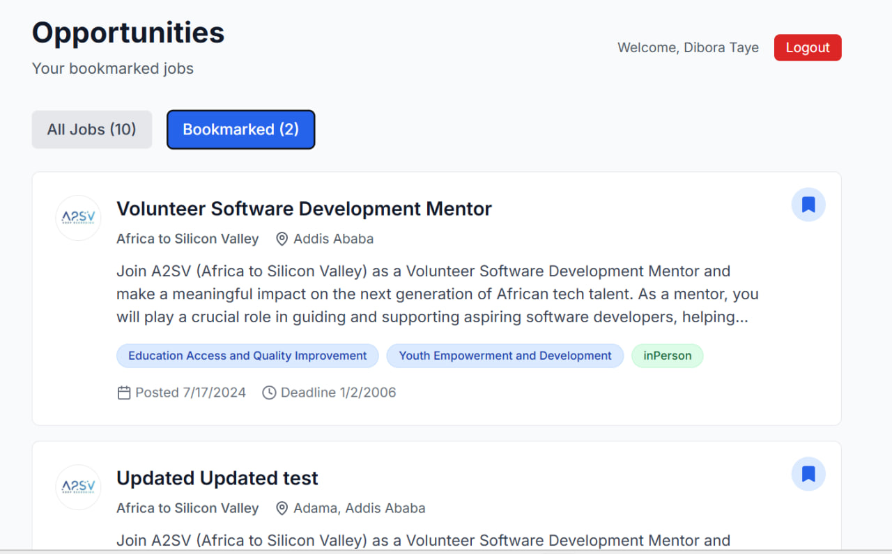

# Job Listing Application

A modern job listing application built with Next.js, TypeScript, and Tailwind CSS. Features user authentication, job search, and bookmark functionality.

## Features

- **User Authentication** - Secure signup, signin, and email verification
- **Bookmark System** - Save and manage favorite job opportunities
- **Responsive Design** - Works seamlessly on desktop and mobile
- **Comprehensive Testing** - Unit tests with Jest and E2E tests with Cypress

## Screenshots

### 2. Sign In Page


_Secure user authentication_

### 4. Job Listings


_Browse and search job opportunities with bookmark functionality_

### 6. Bookmarked Jobs


_View and manage saved job opportunities_


## Getting Started

### Prerequisites

- Node.js 18+
- npm or yarn

### Installation

1. Clone the repository:
   \`\`\`bash
   git clone https://github.com/Dibotaye/job-listener-final-task.git
   cd job-listing-app
   \`\`\`

2. Install dependencies:
   \`\`\`bash
   npm install
   \`\`\`

3. Run the development server:
   \`\`\`bash
   npm run dev
   \`\`\`

4. Open [http://localhost:3000](http://localhost:3000) in your browser.

## Available Scripts

- `npm run dev` - Start development server
- `npm run build` - Build for production
- `npm run start` - Start production server
- `npm run lint` - Run ESLint
- `npm test` - Run Jest tests
- `npm run test:watch` - Run tests in watch mode
- `npm run test:coverage` - Generate test coverage report
- `npm run cypress:open` - Open Cypress test runner
- `npm run cypress:run` - Run Cypress tests headlessly

## API Endpoints

The application integrates with the following API endpoints:

### Authentication

- `POST /signup` - User registration
- `POST /login` - User authentication
- `POST /verify-email` - Email verification

### Jobs

- `GET /opportunities/search` - Fetch job opportunities
- `GET /opportunities/:id` - Get job details

### Bookmarks

- `GET /bookmarks` - Get user bookmarks
- `POST /bookmarks/:eventID` - Add bookmark
- `DELETE /bookmarks/:eventID` - Remove bookmark

## Testing

### Unit Tests (Jest)

\`\`\`bash
npm test
\`\`\`

### E2E Tests (Cypress)

\`\`\`bash
npm run cypress:open
\`\`\`

## Project Structure

```
├── app/                    # Next.js app directory
│   ├── auth/              # Authentication pages
│   ├── globals.css        # Global styles
│   ├── layout.tsx         # Root layout
│   └── page.tsx           # Home page
├── components/            # React components
├── services/              # API services
├── types/                 # TypeScript type definitions
├── utils/                 # Utility functions
├── __tests__/             # Jest tests
├── cypress/               # Cypress E2E tests
└── public/                # Static assets
```

## Technologies Used

- **Frontend**: Next.js 14, React 18, TypeScript
- **Styling**: Tailwind CSS
- **Icons**: Lucide React
- **Testing**: Jest, React Testing Library, Cypress
- **Authentication**: JWT tokens with localStorage
- **API**: RESTful API integration

## Key Features Implementation

### Bookmark Functionality

- Toggle bookmark status on job cards
- Dedicated bookmarked jobs view
- Real-time bookmark count updates
- Authentication-protected bookmark operations

### Authentication System

- Secure user registration and login
- Email verification with OTP
- JWT token management
- Protected routes and API calls

### Error Handling

- Comprehensive error boundaries
- User-friendly error messages
- Network error recovery
- Loading states and feedback
